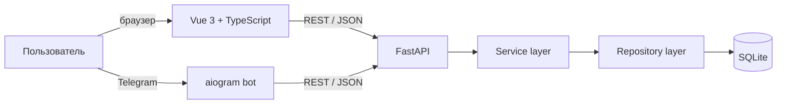

# Cервис онлайн-записи на консультации

Fullstack pet-project: клиент выбирает специалиста, услугу и свободное время, оставляет контакт и создаёт запись — через адаптивный веб-интерфейс или Telegram-бота.

Проект показывает полный цикл разработки продукта: от UX и клиентской валидации до бизнес-логики расписания, REST API, хранения данных, интеграции с Telegram, тестов и контейнеризации.

> MVP без оплаты и проведения реальных консультаций. Интерфейс и демоданные русскоязычные, время хранится и передаётся в UTC.

## Что реализовано

### Для пользователя

- пошаговая запись: специалист → услуга → дата → свободный слот → контакт;
- фильтрация услуг по выбранному специалисту;
- расчёт доступного времени с учётом графика, длительности услуги и уже занятых слотов;
- выбор способа связи: Telegram или телефон;
- понятные состояния загрузки, пустых данных, ошибок и успешной записи;
- повторная загрузка данных без потери заполненной формы;
- адаптивный интерфейс для desktop, tablet и mobile;
- альтернативный сценарий записи через Telegram-бота.

### С инженерной стороны

- асинхронный REST API на FastAPI и SQLAlchemy 2;
- разделение backend на API, service и repository-слои;
- серверная проверка специалиста, услуги, рабочего времени и пересечения записей;
- реактивный frontend на Vue 3 + TypeScript;
- защита интерфейса от устаревших ответов API через отмену запросов;
- OpenAPI-документация, healthcheck API и базы данных;
- изолированные Docker-сервисы для frontend, backend и Telegram-бота;
- unit/runtime-тесты backend и браузерные UI-тесты на Playwright.

## Пользовательский сценарий

1. Клиент выбирает активного специалиста.
2. Frontend загружает услуги, доступные у этого специалиста.
3. После выбора даты API строит свободные слоты по графику и исключает пересечения.
4. Клиент указывает контакт и при желании описывает запрос.
5. Backend повторно валидирует запись, сохраняет её со статусом `pending` и возвращает подтверждение.

Тот же backend обслуживает Telegram-бота: бот регистрирует пользователя по Telegram ID, показывает услуги, даты и свободное время, затем создаёт запись через API.

## Стек

| Область | Технологии |
|---|---|
| Frontend | Vue 3, TypeScript, Vite, Tailwind CSS 4, responsive CSS |
| Backend | Python 3.12, FastAPI, Pydantic 2, Uvicorn |
| Данные | SQLAlchemy 2 Async ORM, SQLite, repository pattern |
| Telegram | aiogram 3, HTTPX |
| Тестирование | `unittest`, FastAPI TestClient, Node Test Runner, Playwright |
| Инфраструктура | Docker, Docker Compose, healthchecks, volumes |

## Архитектура



Frontend и бот не работают с базой напрямую. Вся бизнес-логика записи сосредоточена в backend: HTTP-слой принимает запрос, service-слой проверяет правила, repository-слой выполняет запросы к базе.

Основные сущности:

- `User` — клиент, связанный с Telegram-аккаунтом;
- `Specialist` — специалист, его профиль и статус активности;
- `Service` — услуга, длительность, стоимость и валюта;
- `WorkingSchedule` — интервалы работы по дням недели;
- `Appointment` — запись, контакт клиента и её статус.

## Быстрый запуск через Docker

Понадобится только Docker Desktop с Linux containers и Docker Compose. Python и Node.js локально устанавливать не нужно.

```powershell
# 1. Создать файл окружения
Copy-Item .env.example .env

# 2. Собрать и запустить web-приложение
docker compose up --build -d --wait backend frontend

# 3. Добавить демонстрационного пользователя, специалиста,
#    услугу и расписание Пн–Пт, 09:00–18:00
docker compose exec backend python -m app.seed
```

После запуска доступны:

- web-интерфейс — <http://127.0.0.1:5173>;
- Swagger UI — <http://127.0.0.1:8000/docs>;
- healthcheck — <http://127.0.0.1:8000/health>.

Чтобы подключить Telegram-бота, укажите токен в `.env`:

```dotenv
BOT_TOKEN=your_telegram_bot_token
```

Затем запустите бота:

```powershell
docker compose up -d bot
docker compose logs -f bot
```

> Для одного токена должен работать только один polling-экземпляр бота. Секрет передаётся только контейнеру `bot` и не попадает во frontend.

Остановить проект, сохранив базу данных:

```powershell
docker compose down
```

Данные SQLite хранятся в Docker volume `sqlite_data`. Команда `docker compose down -v` удалит volume вместе с демонстрационной базой.

## Конфигурация

| Переменная | Где используется | Значение по умолчанию / назначение |
|---|---|---|
| `BOT_TOKEN` | Telegram-бот | токен от BotFather; обязателен только для бота |
| `DATABASE_URL` | backend вне Docker | `sqlite+aiosqlite:///./database.db` |
| `API_BASE_URL` | бот вне Docker | `http://127.0.0.1:8000` |
| `VITE_API_BASE_URL` | frontend вне Docker | `http://127.0.0.1:8000` |

В Docker Compose адреса сервисов уже настроены. Порты `5173` и `8000` опубликованы только на `127.0.0.1`.

## REST API

| Метод | Endpoint | Назначение |
|---|---|---|
| `GET` | `/health` | проверить API и соединение с БД |
| `GET` | `/specialists` | получить активных специалистов |
| `GET` | `/services` | получить активные услуги |
| `GET` | `/services/specialist/{id}` | получить услуги специалиста |
| `GET` | `/appointments/available-slots` | рассчитать свободные слоты |
| `GET` | `/appointments/{id}` | получить запись по ID |
| `POST` | `/appointments` | создать запись |
| `POST` | `/users/telegram` | получить или создать Telegram-пользователя |

Полные схемы запросов, ответов и интерактивные примеры доступны в Swagger UI после запуска backend.

## Тестирование

Backend-тесты используют временную SQLite-базу, не затрагивают рабочие данные и не обращаются к Telegram:

```powershell
python -m unittest discover -s tests -v
```

Проверяются загрузка конфигурации, создание схемы БД, успешный healthcheck и ответ `503` при недоступной базе.

Проверки frontend:

```powershell
cd frontend
npm ci
npm run lint
npm run build
```

Браузерные тесты запускаются при работающем frontend и проверяют основной booking flow, валидацию, повторные запросы, обработку конфликтов и адаптивность:

```powershell
npm run test:ui
```

## Структура проекта

```text
.
├── app/
│   ├── api/                 # роутеры, DTO-схемы, зависимости, error handling
│   ├── database/            # SQLAlchemy engine, модели и связи
│   ├── repositories/        # доступ к данным
│   ├── services/            # бизнес-правила записи и расписания
│   ├── telegram_bot/        # aiogram handlers и API-клиент
│   ├── main.py              # FastAPI application
│   └── seed.py              # идемпотентные демоданные
├── frontend/
│   ├── src/entities/        # типы предметной области
│   ├── src/shared/          # API-клиент и общая booking-логика
│   ├── src/App.vue          # основной пользовательский сценарий
│   └── tests/               # Playwright UI-тесты
├── tests/                   # runtime-тесты backend
├── compose.yaml             # локальная fullstack-среда
├── Dockerfile               # единый Python-образ для API и бота
└── requirements.txt
```

## Что можно развить дальше

- авторизация и личные кабинеты клиента и специалиста;
- управление расписанием и статусами записей через административный интерфейс;
- уведомления и перенос/отмена консультации;
- миграции Alembic и PostgreSQL для production-окружения;
- транзакционная защита от одновременного бронирования одного слота;
- CI/CD, production-сборка frontend, HTTPS и мониторинг.

